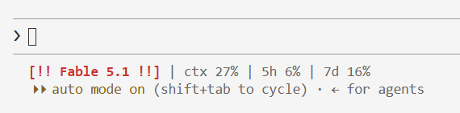

# claude-code-statusline

Claude Code のステータスラインに、モデル名と使用率を表示するスクリプトです。使用率が閾値を跨ぐと、OS の通知を一度だけ出します。ネットワークアクセスも LLM 呼び出しも行いません。Windows 版と macOS 版があります。



Windows 版の表示です。高額モデル（この例では Fable）は赤の太字で強調されます。macOS 版も見た目は同じです。

```
[Sonnet 5] | ctx 42% | 5h 63% | 7d 18%
```

## 表示内容

- `[モデル名]`：`model.display_name`。高額モデルの正規表現に一致すると `[!! モデル名 !!]` と赤の太字になる
- `ctx`：コンテキストウィンドウの使用率
- `5h`：5時間枠のレート制限使用率
- `7d`：7日枠のレート制限使用率

使用率は 50% 以上で黄色、80% 以上で赤になります。

## 構成

```
windows/claude-statusline.ps1   Windows 版（Windows PowerShell 5.1）
windows/test-rearm.ps1          Windows 版の通知ロジックのシナリオテスト
macos/claude-statusline.py      macOS 版（python3、標準ライブラリのみ）
macos/test-rearm.py             macOS 版の通知ロジックのシナリオテスト
```

2 つの実装は、表示形式・通知ロジック・状態ファイルの形式を揃えています。同じ入力を両方に与え、色の制御コードを含む出力と状態ファイルが一致することを確認済みです。

## インストール（Windows）

リポジトリをクローンし、`~/.claude/settings.json` の `statusLine` からクローン先のスクリプトを直接指します。`~/.claude/` へはコピーしません。コピーすると実ファイルとリポジトリの二重管理になるためです。

```json
{
  "statusLine": {
    "type": "command",
    "command": "powershell -NoProfile -File \"C:/<クローン先>/claude-code-statusline/windows/claude-statusline.ps1\""
  }
}
```

パスは自分のクローン先に合わせてください。この方式なら、`git pull` やスクリプトの編集がそのままステータスラインに反映されます。

### Unblock-File の注意

ブラウザ経由（ZIP や Raw の保存）で入手したファイルには、Windows が「インターネットから取得した」印を付けます。実行ポリシーが `RemoteSigned` だと、この印が付いたスクリプトは実行されず、ステータスラインに何も出ません。その場合はブロックを解除します。

```powershell
Unblock-File windows\claude-statusline.ps1
```

`git clone` で取得したファイルには印が付かないため、この手順は不要です。

## インストール（macOS）

必要なのは `python3`（3.9 以上）だけです。Xcode Command Line Tools に含まれるので、`git` が使える Mac には入っています。追加のパッケージは要りません。

Windows 版と同じく、`~/.claude/settings.json` からクローン先のスクリプトを直接指します。

```json
{
  "statusLine": {
    "type": "command",
    "command": "python3 \"/Users/<ユーザー名>/<クローン先>/claude-code-statusline/macos/claude-statusline.py\""
  }
}
```

通知は「スクリプトエディタ」の名義で表示されます。通知が出ないときは、システム設定の「通知」で「スクリプトエディタ」を許可してください。

macOS 版のロジックは Python 3.9 でテスト済みです。通知の表示と色は Mac 実機で未確認で、[Issue #1](https://github.com/hirobirofran/claude-code-statusline/issues/1) に確認項目を残しています。

## カスタマイズ

設定はスクリプト冒頭の `# ---- settings ----` にまとまっています。編集内容は次の描画から反映されます。以下の例は Windows 版の変数名です。macOS 版は同じ位置に `THRESHOLDS`、`HYSTERESIS`、`EXPENSIVE_RE` があります。

### 通知の閾値

`$Thresholds` の配列を書き換えます。単位はパーセントです。

```powershell
$Thresholds   = @(50, 80, 95)          # percent
```

再武装に必要な下げ幅は `$Hysteresis` で変えられます。既定は 5 ポイントです。

```powershell
$Hysteresis   = 5                      # percent points a value must drop below the last threshold to re-arm
```

文字色の境目（50% で黄、80% で赤）は通知の閾値と連動しません。変える場合は `Paint` 関数（macOS 版は `paint`）内の数値を直接編集します。

### 強調するモデル名

`$ExpensiveRe` は `model.display_name` に対する正規表現で、大文字小文字を区別しません。複数のモデルを対象にするなら `|` でつなぎます。

```powershell
$ExpensiveRe  = 'fable|opus'
```

## 仕様

### 通知

通知の対象は `5h` と `7d` です。`ctx` は通知しません。

- 使用率が閾値を跨いだら、一度だけ通知する。同じ閾値では再通知しない
- 複数の閾値を一度に跨いだ場合は、最も高い閾値の通知を 1 回だけ出す
- 使用率が最後に通知した閾値から 5 ポイント超下がったら、通知せずに再武装する。再武装後の基準は、その時点で通過済みの最大の閾値になる
- 5 ポイント以内の下振れは無視する。状態は変わらず、通知も出ない

小さな下振れを無視するのは、複数のターミナルを開いていると、セッションごとに古い使用率が渡されることがあるためです。状態ファイルは全セッションで共有なので、無視しないと閾値付近で通知が鳴り直します。

最後に通知した閾値は `~/.claude/statusline-alert-state.json` に保存します。通知を最初からやり直したいときは、このファイルを削除してください。

どちらの OS でも、通知は別プロセスで送ります。ステータスラインの描画は通知を待ちません。通知は通知センターに残るので、見逃してもあとから確認できます。

Windows 版は標準のトースト通知を使い、「Windows PowerShell」の名義で表示されます。スクリプトが自分自身を `-Notify` 付きで起動して送ります。送信には Windows PowerShell 5.1 が必要です。PowerShell 7 では、トーストに使う WinRT の型を読み込めません。トレイアイコンのバルーン通知を使わないのは、アイコンを破棄した時点で通知センターからも消えるためです。

macOS 版は `osascript` の `display notification` で送ります。メッセージは AppleScript のソースに埋め込まず、引数として渡します。無音だと気づけないので、通知音を鳴らします。音は `NOTIFY_SOUND` で変えられます。既定の `'default'` はシステムの通知音で、`/System/Library/Sounds` にある名前（`'Glass'` など）も指定できます。`''` にすると無音になります。

### rate_limits が無いとき

入力 JSON に `rate_limits` が無い場合、`5h` と `7d` は `--` と表示します。通知は行わず、状態ファイルも更新しません。`rate_limits` は Claude.ai のサブスクリプション利用時に、セッション最初の API 応答以降で渡されます。

入力が JSON として読めなかった場合は `[statusline: bad input]` と表示します。

## テスト

通知ロジック（閾値の判定と再武装）のシナリオテストが、実装ごとにあります。Windows 版なら `Test-Window`、`$Thresholds`、`$Hysteresis` を、macOS 版なら `check_window`、`THRESHOLDS`、`HYSTERESIS` を変更したら実行してください。

```powershell
powershell -NoProfile -File windows\test-rearm.ps1
```

```sh
python3 macos/test-rearm.py
```

全シナリオが通れば `PASSED` と表示し、終了コード 0 を返します。失敗したステップには `FAIL` が付き、終了コードは 1 になります。シナリオと期待値は両方のテストで同一です。

- 下振れ・枠のリセット・再通過（81→79→80→49→58→96→3→52 で通知 4 回）
- ヒステリシスの境界（5 ポイントの下振れは無視、6 ポイントで通知せずに再武装）
- 複数の閾値を一度に跨いだら、最も高い閾値だけ通知

macOS 版のテストは、`rate_limits` が無い入力と不正な入力の表示も確認します。

どちらのテストも、実際の状態ファイルを変更せず、通知も出しません。Windows 版は一時コピーを作り、状態ファイルの場所と通知の起動を差し替えて PowerShell 5.1 で実行します。差し替え対象の行が見つからないときは、実行を拒否して止まります。macOS 版はスクリプトをモジュールとして読み込み、`STATE_FILE` と `notify` を差し替えます。通知を送らないので、Mac 以外でも実行できます。

テスト対象をこのロジックに絞っているのは、状態を持つ唯一の部分で、実際に不具合が出た箇所だからです。通知の見え方や色分けは自動化せず、変更のたびに目視で確認します。CI も設定していません。

## 開発時の注意

通知ロジックを変えるときは、両方の実装を同時に直し、両方のテストを通してください。

`windows/claude-statusline.ps1` と `windows/test-rearm.ps1` は ASCII のみで書きます。PowerShell 5.1 は BOM なしの UTF-8 を ANSI（日本語環境では CP932）として読むため、非 ASCII 文字が混ざると文字化けや構文エラーの原因になります。コメントも英語で書いてください。

macOS 版は、Command Line Tools の `python3`（3.9）で動くように書きます。`match` 文や `X | Y` の型表記など、3.10 以降の構文は使いません。

## ライセンス

[MIT License](LICENSE)
